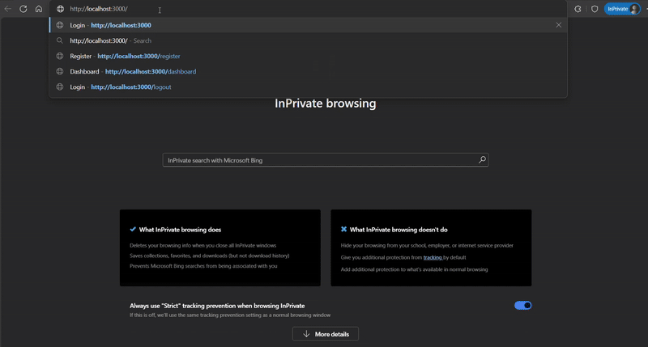
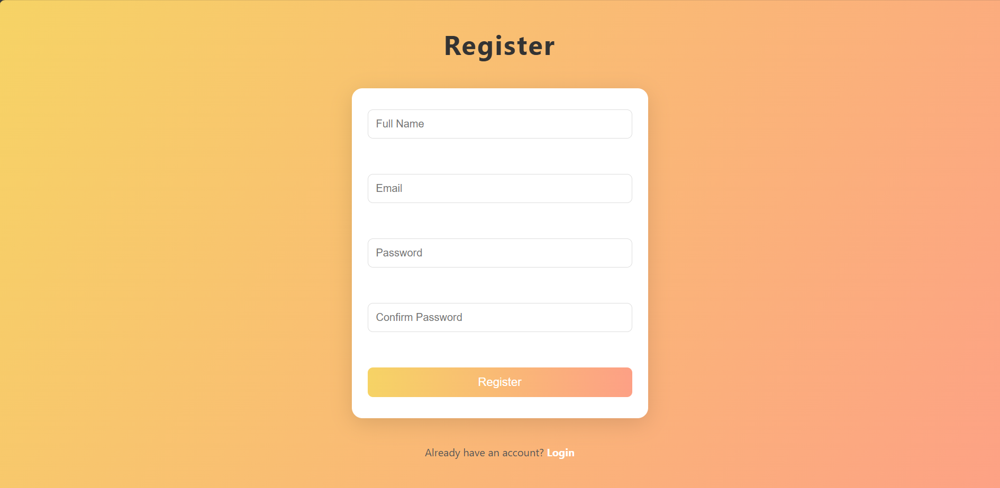
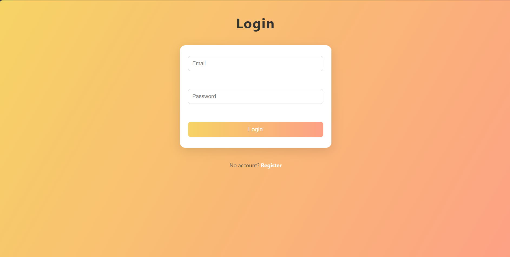

# Auth App T1 (Internship Task 1)

## Tech Stack Used

- **JavaScript**
- **EJS (Embedded JavaScript Templates)**

## Setup & Run Instructions

Please refer to the project files for specific setup scripts and configuration. Typically, for a JavaScript/EJS project, you would:

1. Clone the repository:
   ```bash
   git clone https://github.com/Ali-Amir-code/auth_app_t1.git
   cd auth_app_t1
   ```
2. Install dependencies:
   ```bash
   npm install
   ```
3. Start the application:
   ```bash
   npm start
   ```
4. Access the app in your browser at `http://localhost:3000` (or the configured port).

## Screenshots or Short Demo
### Demo

### Register Page

### Login Page

### Dashboard Page
